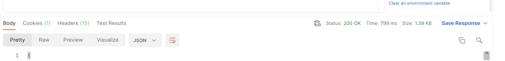

[Back to main page](README.md)

# Installing with the Postman Web UI

Consider this installation option if you can’t install the Postman desktop app.

- [Installing with the Postman Web UI](#installing-with-the-postman-web-ui)
  - [Fork the Collection](#fork-the-collection)
  - [Configure the Collection](#configure-the-collection)
  - [Enable CORS in Salesforce](#enable-cors-in-salesforce)
  - [Authenticate with Salesforce](#authenticate-with-salesforce)
  - [Execute a Request](#execute-a-request)

## Fork the Collection

1. Using a browser, [sign up/in to Postman](https://identity.getpostman.com/login).
2. Navigate to [this link](https://www.postman.com/salesforce-developers/workspace/salesforce-developers/collection/12721794-67cb9baa-e0da-4986-957e-88d8734647e2/fork) to create a fork of the collection.
3. Enter a label for your fork (e.g.: “My fork”).
4. Select a workspace (the default “My Workspace” workspace is fine).
5. Click **Fork Collection**.

## Configure the Collection

Before you can complete these steps, you must have a configured connected app and a Pardot Business Unit. See [Getting Started](https://developer.salesforce.com/docs/marketing/pardot/guide/getting-started.html) for help with creating a connected app and finding your business unit ID.

1. Click **Pardot APIs**
1. Open the **Variables** tab.
2. Update the variables. See the collection documentation for help. 
3. Click **Save**.

## Enable CORS in Salesforce

1. In Salesforce Setup, enter `CORS` in the Quick Find and select **CORS**.
1. Click **New** under Allowed Origins List
1. Enter `https://*.postman.com` as the **Origin URL Pattern**
1. Click **Save**
1. Repeat the previous steps and add `https://*.postman.co` (note the `.co` domain extension)

## Authenticate with Salesforce

You must authenticate to access the APIs. Doing so grants you an access token that is valid for a certain duration.

Repeat this step whenever your access token expires.

1. Click **Salesforce APIs**
2. Open the **Authorization** tab. The authorization type should be set to OAuth 2.0.
3. Click **Get New Access Token**. This opens a browser tab with the Salesforce login screen.
4. Log in to your Salesforce org.
5. Click **Allow** to grant access to your org.
6. If your environment is correctly set up, you should see a success message and be redirected to the Postman app. Click **Use Token** when prompted.

If you're not automatically redirected, you may need to allow popups in your browser.

  

Click here for instructions on how to authorize popups.

    

    Note: these instructions are for Chrome but the steps should be similar with other browsers.

    1. Click the popup error in the address bar, choose to allow popups from Postman:

        

    2. Refresh the page and allow the browser to open the Postman app:

        
    

  

## Execute a Request

1. Expand the collection and select the `Campaigns > Query` request.
1. Click `Send`.

At this point, if your environment is correctly set up, you should see a `200 OK` status. This means that you have successfully authenticated with Salesforce and that you can now use the other collection’s requests.

See [additional documentation](README.md#additional-documentation) for more information on how to keep the collection up to date and work with multiple Salesforce orgs.

[Back to main page](README.md)